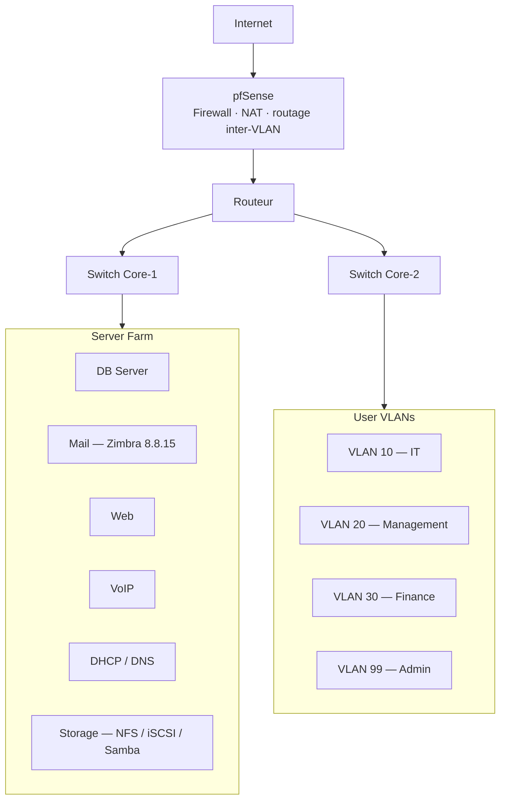

# Enterprise Infrastructure & Security Lab

A segmented enterprise network built and deployed as a final-year project on
PNETLab + VMware: VLAN segmentation, a pfSense perimeter, Active Directory with
automated provisioning, mail (Zimbra), centralized DHCP/DNS, and an isolated
node for security testing.

Domain: `cmc.local` · Network: `10.0.0.0/24` segmented into per-department
subnets · Platform: PNETLab / VMware Workstation.

---

## Architecture

The network is segmented by department. A pfSense firewall handles perimeter
security and controls all inter-VLAN routing; two core switches carry the server
farm and the user VLANs; a DMZ isolates public-facing services.

---

## Addressing plan

The `10.0.0.0` network is split into per-service subnets. The mask is chosen per
segment based on how many hosts it actually needs — small departments get a /28
(14 usable hosts), the admin segment a /29 (6 usable hosts).

| Segment | Subnet | Range | Mask |
|---------|--------|-------|------|
| Gestion | 10.0.0.0/28 | .1 – .14 | /28 |
| IT | 10.0.0.32/28 | .33 – .46 | /28 |
| DMZ | 10.0.0.48/28 | .49 – .62 | /28 |
| COMP | 10.0.0.64/28 | .65 – .78 | /28 |
| pfSense | 10.0.0.80/28 | .81 – .94 | /28 |
| Admin | 10.0.0.96/29 | .97 – .102 | /29 |

Each subnet maps to one department or service. Segmentation limits lateral
movement: a compromised segment cannot freely reach the others, since all
inter-segment traffic must pass through the firewall.

---

## Components

**Network & security.** pfSense firewall (perimeter, NAT, inter-VLAN rules),
VLAN segmentation per department, an isolated DMZ for public services, two
redundant core switches, VPN for remote access, and a Kali Linux node for
security testing.

**Directory services.** Active Directory on the `cmc.local` domain, with OUs
(`ADMIN`, `COMP`, `GESTION`, `IT`), role-based security groups, and automated
user provisioning via PowerShell.

**Mail.** Zimbra Collaboration Suite 8.8.15, AD-integrated authentication, 23
accounts across departments, TLS on `mail.cmc.local`.

**Core services.** DHCP with six segmented scopes (automated via PowerShell),
internal DNS (`10.0.0.50`), and a storage server exposing NFS / iSCSI / Samba.

---

## Automation

Two PowerShell scripts remove the repetitive parts of standing the environment
up (see [`scripts/`](scripts/)).

`Create-ADUsers.ps1` — provisions AD accounts: generates the login (first
initial + surname), places each user in the right OU, assigns security groups,
forces a password change at first logon, and logs each operation.

`Configure-DHCP.ps1` — creates the six DHCP scopes (one per segment) with their
ranges, masks, gateways and DNS. Idempotent: it skips scopes that already exist.

> These target the lab (`cmc.local`, `10.0.0.0/24` segmented). Adapt the domain,
> OUs and ranges before running elsewhere, and test outside production first.

<!--
TODO (à compléter par toi pour tuer définitivement l'effet "template") :

1. Un ou deux VRAIS obstacles rencontrés + comment tu les as résolus.
   Ex : "Le routage inter-VLAN ne passait pas tant que je n'avais pas ajouté
   une règle pfSense autorisant explicitement le VLAN Finance vers le DNS."
   C'est CE genre de détail vécu qu'aucune IA n'invente.

2. Un extrait réel d'une de tes règles pfSense (source / destination / port),
   ou 5-6 lignes de ton Create-ADUsers.ps1.

3. Pourquoi 2 core switches ? (redondance ? répartition de charge ?) — explique
   ton choix en une phrase.
-->

---

## Stack

| Domaine | Outils |
|---------|--------|
| Virtualisation | PNETLab, VMware Workstation |
| Firewall | pfSense |
| Annuaire | Windows Server 2019, Active Directory |
| Mail | Zimbra 8.8.15 |
| Services | DHCP, DNS, NFS, iSCSI, Samba |
| Test sécurité | Kali Linux |
| Automatisation | PowerShell |
| OS | Windows Server 2019, Ubuntu Server 22.04 |

---

## Screenshots

Captures of the deployed environment are in [`screenshots/`](screenshots/):
PNETLab topology, Active Directory structure, Zimbra admin, DHCP scopes.

---

## Author

**Douae Karachi** — [LinkedIn](https://linkedin.com/in/douae-karachi) ·
[Portfolio](https://cspjcts.pages.dev/)

Final-year project (2024–2025). Some parts were done collaboratively with
classmates; the network design, the Active Directory automation and the DHCP
configuration documented here are my own contributions.
